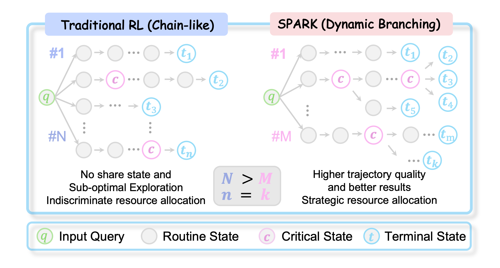
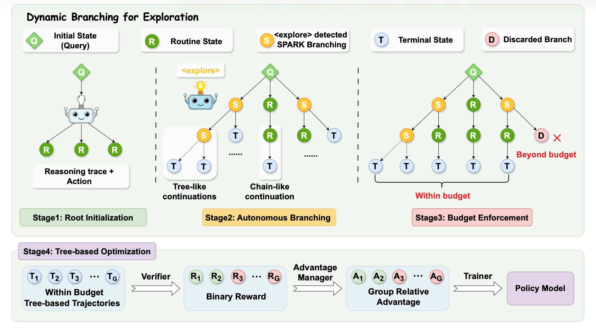
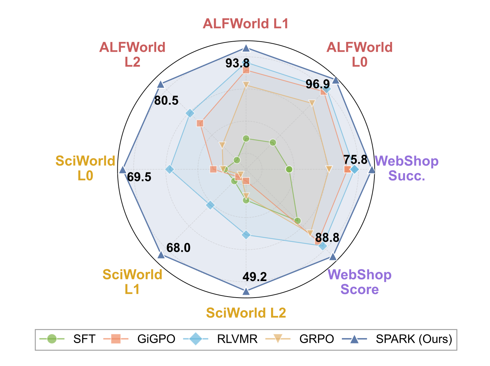

<p align="center">
  
</p>
<h1 align="left">
SPARK: Strategic Policy-Aware Exploration via Dynamic Branching for
Long-Horizon Agentic Learning
</h1>
<p align="center">
  <a href="https://arxiv.org/abs/2601.20209">
    </a>
  &nbsp;
  <a href="x">
    </a>
  &nbsp;
  <a href="https://huggingface.co/papers/2601.20209">
    </a>
  &nbsp;
</p>

<!-- This repository is the official implementation of "[SPARK: Strategic Policy-Aware Exploration via Dynamic Branching for Long-Horizon Agentic Learning](https://arxiv.org/abs/2601.20209)". -->

# 💡 Introduction
**SPARK** (**S**trategic **P**olicy-**A**ware explo**R**ation via **K**ey-state dynamic branching) is a reinforcement learning framework specifically engineered for **long-horizon agentic tasks**. 

Traditional exploration often suffers from "blind coverage." SPARK’s key insight is to activate **adaptive branching exploration** only at critical decision points. This allows for precise resource allocation, prioritizing sampling quality over quantity.

<!-- We introduce **SPARK** (**S**trategic **P**olicy-**A**ware explo**R**ation via **K**ey-state dynamic branching), a reinforcement learning framework designed for long-horizon agentic tasks. Our key insight is to activate adaptive
branching exploration at critical decision points
to probe promising trajectories, thereby achieving precise resource allocation that prioritizes
sampling quality over blind coverage. -->

<p align="center">
  
    <br>
    <em>Figure 1: Paradigm comparison: uniform vs. strategic exploration.</em>
</p>

### 🌟 Core Steps
* **Root Initialization**: Generates diverse starting trajectories to broaden the search space.
* **Autonomous Branching**: Selectively expands trajectories at high-uncertainty states using intrinsic `<explore>` signals.
* **Budget Enforcement**: Strategically constrains tree growth to stay within computational limits.


<p align="center">
  
    <br>
    <em>Figure 2: Overview of SPARK framework.</em>
</p>

### 📊 Main Results
Experiments on challenging tasks (ALFWorld, ScienceWorld, WebShop) demonstrate that SPARK achieves superior performance over baselines.
<p align="center">
  
    <br>
    <em>Figure 3: Multi-benchmark performance comparison on 1.5B backbone.</em>
</p>

# ⚙️ Installation
We recommend maintaining a separate conda environment for each environment.


### 1. ALFWorld
Install with pip:
```bash
# conda environment
conda create -n spark-alfworld python==3.10 -y
conda activate spark-alfworld
# training infra
pip3 install torch==2.6.0 --index-url https://download.pytorch.org/whl/cu124
pip3 install flash-attn==2.7.4.post1 --no-build-isolation
pip3 install -e .
pip3 install vllm==0.8.5
# env package
pip3 install gymnasium==0.29.1
pip3 install stable-baselines3==2.6.0
pip3 install alfworld
```

Download PDDL & Game files and pre-trained MaskRCNN detector (will be stored in `~/.cache/alfworld/` by default).:
```bash
# Download to ~/.cache/alfworld/ by default
alfworld-download -f
```
Note: You must correctly specify `env.alfworld.data_path` in `verl/trainer/config/ppo_trainer.yaml`; otherwise, the environment will fail to load the data.

Play a Textworld game:
```bash
alfworld-play-tw
```
---
### 2. ScienceWorld
```bash
# conda environment
conda create -n spark-sciworld python==3.10 -y
conda activate spark-sciworld
# training infra
pip3 install torch==2.6.0 --index-url https://download.pytorch.org/whl/cu124
pip3 install flash-attn==2.7.4.post1 --no-build-isolation
pip3 install -e .
pip3 install vllm==0.8.5
# env package
pip3 install scienceworld
```

### 3. WebShop
Create a new `spark-webshop` environment
```bash
# conda environment
conda create -n spark-webshop python==3.10 -y
conda activate spark-webshop
```

Install WebShop
```bash
# env package
cd ./agent_system/environments/env_package/webshop/webshop
./setup.sh -d all
```
⚠️ Note: If you encounter issues with gdown, you may need to visit `https://drive.google.com/`, get your Google Drive cookie, and paste it into `.cache/gdown/cookies.txt`.
Or you may need to manually download the files.

After WebShop is installed, return to the root directory of the repository and install the verl package:
```bash
# training infra
cd repo_root/
pip3 install torch==2.6.0 --index-url https://download.pytorch.org/whl/cu124
pip3 install flash-attn==2.7.4.post1 --no-build-isolation
pip3 install -e .
pip3 install vllm==0.8.5
```
The warnings can be safely ignored.


# 🚀 Training Pipeline
### Step 1: Data Preparation
Query LLMs to generate reasoning paths for samples with golden actions located in `data/expert_traj`.
```bash
python data/all_annotation.py
python data/formulate_annotation_data.py
```
Extract interaction logs between teacher models and environments.
```bash
# Choose the conda environment: spark-alfworld, spark-sciworld, or spark-webshop
conda activate spark-alfworld
bash data/teacher_api_agent_all.sh
```
Consolidate the reasoning annotations and interaction logs into a final dataset.
```bash
python merge_sft_data.py
```
### Step 2: Cold Start
Our main experiments are based on Qwen2.5-1.5B-Instruct and Qwen2.5-7B-Instruct. Please download these two models first for use.

Use the script below for the cold-start process. Set the `model_path` to your downloaded model and `trainer.default_local_dir` for the SFT output, then run the following command to start training:
```bash
# For 1.5B Backbone
bash examples/sft/cold_start/all_1.5b.sh

# For 7B Backbone
bash examples/sft/cold_start/all_7b.sh
```
### Step 3: RL Training
Before running the RL training script, ensure `cs_model_path` points to your cold-start model directory and `SAVE_PATH` is set to your desired checkpoint location. Once configured, execute the script:

```bash
export VERL_AUTO_PADDING=1
bash examples/spark_trainer/ys_run_alfworld_branch_cs_bsz16.sh
```

# 🛠 Customize
### 🔀 Modify branching algorithm
- **To customize the main loop logic**: Modify the `branching_multi_turn_loop_with_masks `function located in `agent_system/multi_turn_rollout/rollout_loop.py`.

- **To adjust branching criteria**: Replace or update the `explore_branching_condition function` in `agent_system/multi_turn_rollout/branch_utils.py`.

### 🌍 New Enviroments
Please follow the instrcutions below:
1. Create your environment package in `agent_system/environments/env_package/`.

2. Write the corresponding prompt files in the `agent_system/environments/prompts/` directory.

3. Add an environment manager in   `agent_system/environments/env_manager.py`.


# 🤝 Acknowledgement
We sincerely appreciate the following awesome projects:
- Agentic RL training infrastructure:  [veRL](https://github.com/volcengine/verl), [verl-agent](https://github.com/langfengQ/verl-agent/) and [RLVMR](https://github.com/Tencent/digitalhuman/tree/main/RLVMR). 
- Interactive environments: [ALFWorld](https://github.com/alfworld/alfworld), [ScienceWorld](https://github.com/allenai/ScienceWorld), [WebShop](https://github.com/princeton-nlp/WebShop)

# 📑 Citation
If you find this repo useful for your research, we would appreciate it if you could cite our work:
```
@misc{wu2026sparkstrategicpolicyawareexploration,
      title={Spark: Strategic Policy-Aware Exploration via Dynamic Branching for Long-Horizon Agentic Learning}, 
      author={Jinyang Wu and Shuo Yang and Changpeng Yang and Yuhao Shen and Shuai Zhang and Zhengqi Wen and Jianhua Tao},
      year={2026},
      eprint={2601.20209},
      archivePrefix={arXiv},
      primaryClass={cs.LG},
      url={https://arxiv.org/abs/2601.20209}, 
}
```

